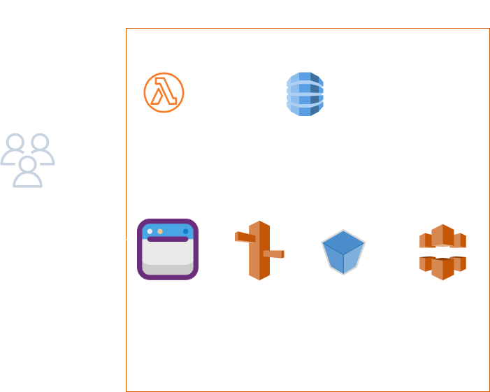
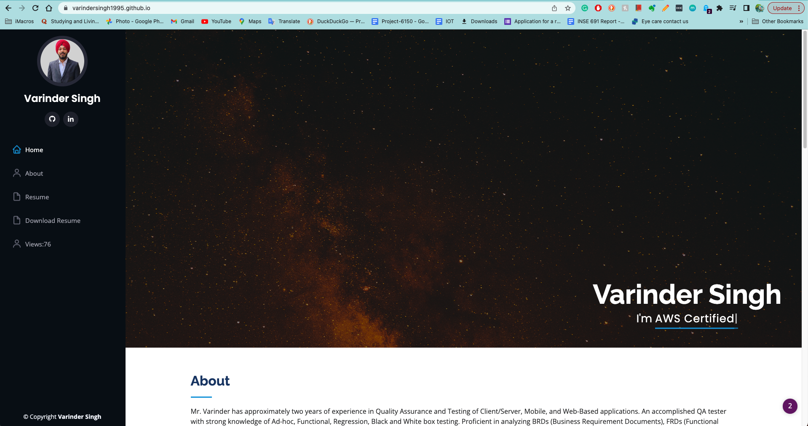

# AWS Cloud Resume Challenge
This is my attempt at cloud resume challenge in AWS. What is Cloud Resume Challenge? - The Cloud Resume Challenge is a multiple-step resume project which helps build and demonstrate skills fundamental to pursuing a career in Cloud. The project was published by Forrest Brazeal.
# Arhitecture


# Services Used:

S3
* AWS CloudFront
* Certificate Manager
* AWS Lambda
* Dynamo DB
* GitHub Actions
* Terraform

## Portfolio
 

 ## Lambda function to store values in Dynamo DB
 ```
import json
import boto3
dynamodb = boto3.resource('dynamodb')
table = dynamodb.Table('resume-challenge')
def lambda_handler(event, context):
    response = table.get_item(Key={
        'id':'0'
    })
    views = response['Item']['views']
    views = views + 1
    print(views)
    response = table.put_item(Item={
            'id':'0',
            'views': views
    })

    return views
```
  
